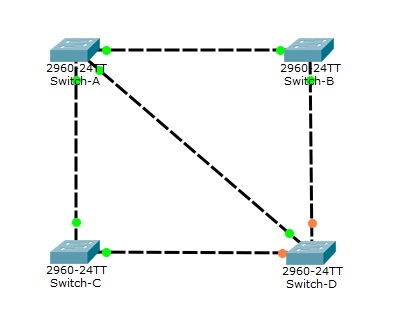

# sesion7-tarea-individual

Realiza y explica los pasos que se realizan en el protocolo STP para solucionar los bucles de la siguiente figura.

Todos los conmutadores tienen la misma prioridad. 

Sus direcciones MAC son las siguientes:
1. SW1: A3:34:1F:D2:FD:A1
2. SW2: A3:34:1E:D2:FD:A2
3. SW3: A3:34:1F:D2:FD:A3
4. SW4: A3:34:1E:D2:FD:A4

Todos los puertos son FastEthernet

